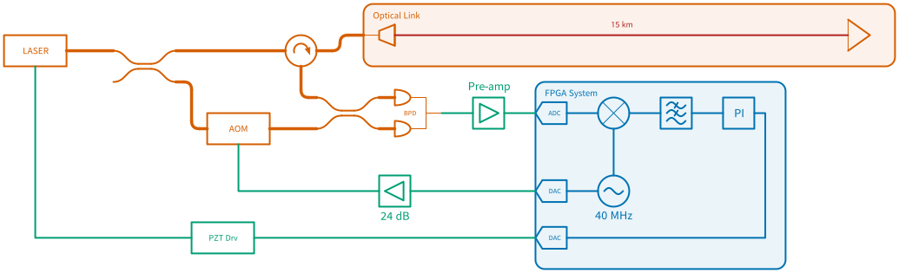

<h1 align="center">Quickdraw</h1>

<p align="center">
  <strong>Drag-and-drop lab diagrams — FPGA/DSP, fibre optics, free-space optics, analog/RF.</strong>
</p>

<p align="center">
  <a href="../../releases/latest"></a>
  <a href="LICENSE"></a>
  <a href="docs/index.md"></a>
</p>

<p align="center">
  
</p>

<p align="center">
  <sub>A fibre link stabilised over 15 km — the optics, the RF chain and the
  FPGA servo in one diagram, exported straight to SVG.</sub>
</p>

Quickdraw draws the diagram that ends up in a lab notebook, a group-meeting slide or a
paper figure. Drag components from a palette, drop them on a grid, pull wires between
ports. It routes the wires around your components, styles each one by what it carries —
coax, digital, fibre, free-space beam — and exports clean vector SVG.

## Download

Get the file for your platform from the [**latest release**](../../releases/latest).

| | File | What to do with it |
|---|---|---|
| **macOS** | `.dmg` | Open it, drag **Quickdraw** to Applications. |
| **Windows** | `.zip` | Extract the whole `Quickdraw` folder somewhere permanent — not inside the zip viewer — and run `Quickdraw.exe` from it. |

Nothing else to install: Python, Qt and every dependency are inside the bundle.

<details>
<summary><strong>First launch shows a security warning — here's how to get past it</strong></summary>

<br>

Quickdraw isn't signed with a paid Apple or Microsoft developer certificate, so the first
time you open it your computer will say it can't verify the app. This is expected for a
lab tool distributed this way, and you only need to do it once.

**macOS** — if you see *"Apple could not verify Quickdraw is free of malware"*, open
Terminal and run:

```
xattr -dr com.apple.quarantine /Applications/Quickdraw.app
```

Then open Quickdraw normally. That removes the "downloaded from the internet" flag; it
doesn't change the app. On macOS Sequoia (15) and later you can instead open **System
Settings → Privacy & Security**, scroll to the bottom, and click **Open Anyway** after
the first blocked attempt.

**Windows** — if SmartScreen shows *"Windows protected your PC"*, click **More info**,
then **Run anyway**.

</details>

## Manual

The [**manual**](docs/index.md) ships with each release: ten guides plus a reference
for all 88 symbols, generated from the symbol library itself.

| | |
|---|---|
| [Getting started](docs/getting-started.md) | Install it and learn what the window is made of |
| [Drawing a diagram](docs/drawing.md) | Place symbols, wire them together, do it quickly |
| [Wires](docs/wires.md) · [Connections](docs/connections.md) | Wire kinds, routing, connectors, splices, insertion loss |
| [Getting it out](docs/output.md) | SVG, PNG, PDF, Clean View, patch-list CSV |
| [Symbol reference](docs/generated/index.md) | All 88 symbols, with ports and parameters |
| [Keyboard reference](docs/keyboard.md) | Every shortcut, on one page |

## Your diagrams

Quickdraw saves to `.dsd` — plain-text JSON, readable and diffable, that you can keep next
to your data or in version control. Old files always open in newer builds. Export is SVG
(vector, publication-ready); PNG and PDF are in the same menu.

## Updates

New versions are posted here. Watch this repository (**Watch → Custom → Releases**) to
hear about one when it lands. Quickdraw 0.5.1 and later can also check for itself, from
**Help → Check for Updates…**.

## Problems and requests

Open an [issue](../../issues) — bug reports, symbols you need, and diagrams that came out
wrong are all welcome. Include your Quickdraw version (**Help → About**) and your OS.

---

<sub>This repository is the downloads front door for Quickdraw: released builds and the
manual, nothing else. Licensed [MIT](LICENSE). The `docs/` folder is regenerated from the
source repository on each release — open an issue rather than editing it here.</sub>
