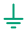
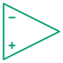
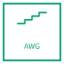
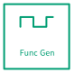
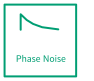
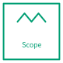
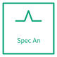
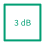
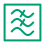
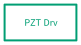

# Analog and RF

Analog components, RF blocks, servo and bench instruments.

25 symbols. Generated from the symbol registry — see the note in
[the index](index.md).

## Components

### Capacitor

Key: `analog.capacitor`

**Ports** — `p1` (analog), `p2` (analog)

### Ground

Key: `analog.gnd`

**Ports** — `p1` (analog)

### Inductor

Key: `analog.inductor`

**Ports** — `p1` (analog), `p2` (analog)

### Op-amp

Key: `analog.opamp`

**Ports** — `in1` (analog), `in2` (analog), `out` (analog)

### Resistor

Key: `analog.resistor`

**Ports** — `p1` (analog), `p2` (analog)

### Voltage Source

Key: `analog.vsource`

**Ports** — `p1` (analog), `p2` (analog)

## Instruments

### AWG

Key: `analog.awg`

**Ports** — `n` (analog), `out` (analog), `s` (analog)

### Frequency Counter

Key: `analog.freq_counter`

**Ports** — `in` (analog), `n` (analog), `s` (analog)

### Function Generator

Key: `analog.func_gen`

**Ports** — `n` (analog), `out` (analog), `s` (analog)

### Phase Noise

Key: `analog.phase_noise`

**Ports** — `in` (analog), `n` (analog), `s` (analog)

### Scope

Key: `analog.scope`

**Ports** — `in1` (analog), `in2` (analog), `n` (analog), `s` (analog)

### Spectrum Analyser

Key: `analog.spec_an`

**Ports** — `in` (analog), `n` (analog), `s` (analog)

## RF Blocks

### Attenuator

Key: `analog.attenuator`

**Ports** — `in` (analog), `n` (analog), `out` (analog), `s` (analog)

| Parameter | Default | Accepts |
|---|---|---|
| `db` | `3` | 0 to 60, step 1 |

### Bias Tee

Key: `analog.bias_tee`

**Ports** — `dc` (analog), `out` (analog), `rf` (analog), `s` (analog)

### Directional Coupler

Key: `analog.dir_coupler`

**Ports** — `cpl` (analog), `in` (analog), `n` (analog), `out` (analog)

### RF Filter

Key: `analog.filter`

**Ports** — `in` (analog), `n` (analog), `out` (analog), `s` (analog)

| Parameter | Default | Accepts |
|---|---|---|
| `response` | `lp` | `lp`, `hp`, `bp`, `notch` |

### RF Mixer

Key: `analog.mixer`

**Ports** — `if` (analog), `lo` (analog), `n` (analog), `rf` (analog)

### Phase Detector

Key: `analog.phase_det`

**Ports** — `in1` (analog), `in2` (analog), `n` (analog), `out` (analog)

### RF Amplifier

Key: `analog.rf_amp`

**Ports** — `in` (analog), `out` (analog)

### RF Splitter

Key: `analog.splitter`

**Ports** — `in` (analog), `n` (analog), `out1` (analog), `out2` (analog), `s` (analog)

### VCO

Key: `analog.vco`

**Ports** — `n` (analog), `out` (analog), `s` (analog), `tune` (analog)

## Servo

### Adder

Key: `analog.adder`

**Ports** — `e` (analog), `in_n` (analog), `in_s` (analog), `in_w` (analog), `n` (analog), `out` (analog), `s` (analog), `w` (analog)

| Parameter | Default | Accepts |
|---|---|---|
| `op` | `add` | `add`, `subtract` |

### PID Servo

Key: `analog.pid`

**Ports** — `in` (analog), `mon` (analog), `n` (analog), `out` (analog)

### Piezo Driver

Key: `analog.piezo_drv`

**Ports** — `in` (analog), `n` (analog), `out` (analog), `s` (analog)

### Temperature Controller

Key: `analog.temp_ctrl`

**Ports** — `in` (analog), `n` (analog), `out` (analog), `s` (analog)
