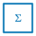
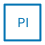
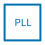
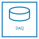
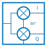
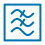
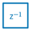
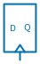
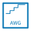
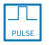

# DSP and digital

Digital signal processing, control and converters.

20 symbols. Generated from the symbol registry — see the note in
[the index](index.md).

## Arithmetic

### Accumulator

Key: `dsp.accumulator`

**Ports** — `e` (digital), `in` (digital), `n` (digital), `out` (digital), `s` (digital), `w` (digital)

### Adder

Key: `dsp.adder`

**Ports** — `e` (digital), `in_n` (digital), `in_s` (digital), `in_w` (digital), `n` (digital), `out` (digital), `s` (digital), `w` (digital)

| Parameter | Default | Accepts |
|---|---|---|
| `op` | `add` | `add`, `subtract` |

### Gain

Key: `dsp.gain`

**Ports** — `in` (digital), `out` (digital)

### Multiplier

Key: `dsp.multiplier`

**Ports** — `e` (digital), `in_n` (digital), `in_s` (digital), `in_w` (digital), `n` (digital), `out` (digital), `s` (digital), `w` (digital)

## Control

### Phase Detector

Key: `dsp.phase_det`

**Ports** — `n` (digital), `out` (digital), `ref` (digital), `sig` (digital)

### PI Controller

Key: `dsp.pi`

**Ports** — `e` (digital), `in` (digital), `n` (digital), `out` (digital), `s` (digital), `w` (digital)

### PLL

Key: `dsp.pll`

**Ports** — `e` (digital), `n` (digital), `out` (digital), `ref` (digital), `s` (digital), `w` (digital)

## Converters

### ADC

Key: `dsp.adc`

**Ports** — `e` (digital), `in` (analog), `out` (digital), `w` (analog)

### DAC

Key: `dsp.dac`

**Ports** — `e` (analog), `in` (digital), `out` (analog), `w` (digital)

### DAQ / Save to Disk

Key: `dsp.daq`

**Ports** — `e` (digital), `in1` (analog), `in2` (analog), `n` (digital), `s` (digital)

Its parameters change which ports it has and what they carry; these are the defaults.

| Parameter | Default | Accepts |
|---|---|---|
| `channels` | `2` | 1 to 8, step 1 |

## Detectors

### IQ Demod

Key: `dsp.iq_demod`

**Ports** — `i` (digital), `in` (digital), `lo` (digital), `n` (digital), `q` (digital)

### Zero-Span Detector

Key: `dsp.zero_span`

**Ports** — `e` (digital), `in` (digital), `n` (digital), `out` (digital), `s` (digital), `w` (digital)

| Parameter | Default | Accepts |
|---|---|---|
| `center_mhz` | `0` | 0 to 40000, step 1 |

## Filters

### Filter

Key: `dsp.filter`

**Ports** — `e` (digital), `in` (digital), `n` (digital), `out` (digital), `s` (digital), `w` (digital)

| Parameter | Default | Accepts |
|---|---|---|
| `response` | `lp` | `lp`, `hp`, `bp`, `notch` |

## Registers

### Delay (z⁻ⁿ)

Key: `dsp.delay`

**Ports** — `e` (digital), `in` (digital), `n` (digital), `out` (digital), `s` (digital), `w` (digital)

| Parameter | Default | Accepts |
|---|---|---|
| `n` | `1` | 1 to 64, step 1 |

### Register

Key: `dsp.register`

**Ports** — `clk` (digital), `d` (digital), `q` (digital)

## Sources

### AWG

Key: `dsp.awg`

**Ports** — `e` (digital), `n` (digital), `out` (digital), `s` (digital), `trig` (digital), `w` (digital)

### Clock

Key: `dsp.clock`

**Ports** — `e` (digital), `n` (digital), `out` (digital), `ref` (digital), `s` (digital), `w` (digital)

### DDS / NCO

Key: `dsp.dds`

**Ports** — `e` (digital), `ftw` (digital), `n` (digital), `out` (digital), `s` (digital), `w` (digital)

### Pulse Gen

Key: `dsp.pulse_gen`

**Ports** — `e` (digital), `n` (digital), `out` (digital), `s` (digital), `trig` (digital), `w` (digital)

## Wiring

### Node

Key: `dsp.node`

**Ports** — `center` (digital), `e` (digital), `n` (digital), `s` (digital), `w` (digital)
