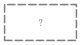

# Miscellaneous

Annotations, text and everything that is not a device.

4 symbols. Generated from the symbol registry — see the note in
[the index](index.md).

## Misc

### Generic box

Key: `misc.box`

**Ports** — `in1` (analog), `n` (analog), `out1` (analog), `s` (analog)

Its parameters change which ports it has; these are the defaults.

| Parameter | Default | Accepts |
|---|---|---|
| `height` | `1` | 0.5 to 12, step 0.5 |
| `n_in` | `1` | 0 to 12, step 1 |
| `n_out` | `1` | 0 to 12, step 1 |
| `text` | — | any text |
| `width` | `2` | 1 to 12, step 0.5 |

### Text note

Key: `misc.text`

No ports — nothing connects to it.

| Parameter | Default | Accepts |
|---|---|---|
| `size` | `1` | 0.25 to 4, step 0.25 |
| `text` | `Note` | any text |

### Title block

Key: `misc.title`

No ports — nothing connects to it.

| Parameter | Default | Accepts |
|---|---|---|
| `subtitle` | — | any text |
| `title` | `Untitled` | any text |
| `width` | `5` | 2 to 16, step 0.5 |

### Unresolved symbol

Key: `misc.unresolved`

**Ports** — `in` (analog), `out` (analog)

| Parameter | Default | Accepts |
|---|---|---|
| `key` | `?` | any text |
