# Optics

Fibre and free-space: sources, modulators, couplers and detectors.

39 symbols. Generated from the symbol registry — see the note in
[the index](index.md).

## Couplers

### Coupler 2x2

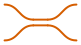

Key: `optics.coupler_2x2`

**Ports** — `in1` (optical), `in2` (optical), `out1` (optical), `out2` (optical)

| Parameter | Default | Accepts |
|---|---|---|
| `ratio` | — | *(unset)*, `50:50`, `60:40`, `70:30`, `80:20`, `90:10`, `95:5`, `99:1` |

### Fibre PBS

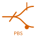

Key: `optics.pbs_fibre`

**Ports** — `in` (optical), `out1` (optical), `out2` (optical)

### Splitter 1x2

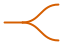

Key: `optics.splitter_1x2`

**Ports** — `in` (optical), `out1` (optical), `out2` (optical)

### WDM

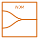

Key: `optics.wdm`

**Ports** — `in1` (optical), `in2` (optical), `n` (optical), `out` (optical), `s` (optical)

## Detectors

### Balanced PD

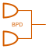

Key: `optics.bpd`

**Ports** — `in1` (optical), `in2` (optical), `out` (analog)

Its parameters change what they carry; these are the defaults.

| Parameter | Default | Accepts |
|---|---|---|
| `mode` | `fibre` | `fibre`, `free_space` |

### Photodiode

Key: `optics.pd`

**Ports** — `in` (optical), `out` (analog)

Its parameters change what they carry; these are the defaults.

| Parameter | Default | Accepts |
|---|---|---|
| `mode` | `fibre` | `fibre`, `free_space` |

### Power Meter

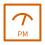

Key: `optics.power_meter`

**Ports** — `in` (optical), `out` (analog)

Its parameters change what they carry; these are the defaults.

| Parameter | Default | Accepts |
|---|---|---|
| `mode` | `fibre` | `fibre`, `free_space` |

## Fibre

### Delay Line

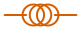

Key: `optics.delay_line`

**Ports** — `in` (optical), `out` (optical)

| Parameter | Default | Accepts |
|---|---|---|
| `length` | — | *(unset)*, `1 m`, `2 m`, `5 m`, `10 m`, `20 m`, `50 m`, `100 m`, `1 km` |

### FBG

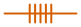

Key: `optics.fbg`

**Ports** — `in` (optical), `out` (optical)

### Polarisation Controller

Key: `optics.pol_ctrl`

**Ports** — `in` (optical), `out` (optical)

## Free space

### Beam Dump

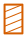

Key: `optics.beam_dump`

**Ports** — `in` (beam)

### Beamsplitter

Key: `optics.bs`

**Ports** — `in` (beam), `r` (beam), `s` (beam), `t` (beam)

### Cavity

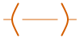

Key: `optics.cavity`

**Ports** — `in` (beam), `out` (beam)

### Collimator

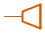

Key: `optics.collimator`

**Ports** — `beam` (beam), `fib` (optical)

### Dichroic

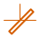

Key: `optics.dichroic`

**Ports** — `in` (beam), `r` (beam), `t` (beam)

### Lens

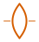

Key: `optics.lens`

**Ports** — `in` (beam), `out` (beam)

### Mirror

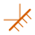

Key: `optics.mirror`

**Ports** — `in` (beam), `out` (beam)

### Plane Mirror

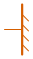

Key: `optics.mirror_flat`

**Ports** — `in` (beam)

### PBS

Key: `optics.pbs`

**Ports** — `in` (beam), `r` (beam), `s` (beam), `t` (beam)

### Corner Cube

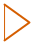

Key: `optics.retro`

**Ports** — `in` (beam)

### Telescope

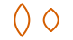

Key: `optics.telescope`

**Ports** — `in` (beam), `out` (beam)

### λ/2 Waveplate

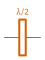

Key: `optics.waveplate_half`

**Ports** — `in` (beam), `out` (beam)

### λ/4 Waveplate

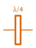

Key: `optics.waveplate_quarter`

**Ports** — `in` (beam), `out` (beam)

## Gain & loss

### Optical Amplifier

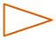

Key: `optics.amp`

**Ports** — `in` (optical), `out` (optical)

Its parameters change what they carry; these are the defaults.

| Parameter | Default | Accepts |
|---|---|---|
| `db` | `0` | 0 to 40, step 1 |
| `mode` | `fibre` | `fibre`, `free_space` |

### Optical Attenuator

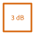

Key: `optics.attenuator`

**Ports** — `in` (optical), `out` (optical)

Its parameters change what they carry; these are the defaults.

| Parameter | Default | Accepts |
|---|---|---|
| `db` | `3` | 0 to 60, step 1 |
| `mode` | `fibre` | `fibre`, `free_space` |
| `variable` | `false` | any text |

## Isolation

### Circulator

Key: `optics.circulator`

**Ports** — `p1` (optical), `p2` (optical), `p3` (optical), `s` (optical)

### Isolator

Key: `optics.isolator`

**Ports** — `in` (optical), `n` (optical), `out` (optical), `s` (optical)

Its parameters change what they carry; these are the defaults.

| Parameter | Default | Accepts |
|---|---|---|
| `mode` | `fibre` | `fibre`, `free_space` |

## Modulators

### AOM

Key: `optics.aom`

**Ports** — `in` (optical), `n` (analog), `out` (optical), `rf` (analog)

Its parameters change what they carry; these are the defaults.

| Parameter | Default | Accepts |
|---|---|---|
| `mode` | `fibre` | `fibre`, `free_space` |

### EOM

Key: `optics.eom`

**Ports** — `in` (optical), `n` (analog), `out` (optical), `rf` (analog)

Its parameters change what they carry; these are the defaults.

| Parameter | Default | Accepts |
|---|---|---|
| `mode` | `fibre` | `fibre`, `free_space` |

### IQ Modulator

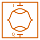

Key: `optics.iq_mod`

**Ports** — `i` (analog), `in` (optical), `out` (optical), `q` (analog)

Its parameters change what they carry; these are the defaults.

| Parameter | Default | Accepts |
|---|---|---|
| `mode` | `fibre` | `fibre`, `free_space` |

### Pol Scrambler

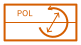

Key: `optics.pol_scrambler`

**Ports** — `drive` (analog), `in` (optical), `n` (analog), `out` (optical)

Its parameters change what they carry; these are the defaults.

| Parameter | Default | Accepts |
|---|---|---|
| `mode` | `fibre` | `fibre`, `free_space` |

## Non-linear

### OPA

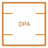

Key: `optics.opa`

**Ports** — `idler` (optical), `pump` (optical), `seed` (optical), `signal` (optical)

Its parameters change what they carry; these are the defaults.

| Parameter | Default | Accepts |
|---|---|---|
| `mode` | `fibre` | `fibre`, `free_space` |

### SHG

Key: `optics.shg`

**Ports** — `in` (optical), `out` (optical)

Its parameters change what they carry; these are the defaults.

| Parameter | Default | Accepts |
|---|---|---|
| `mode` | `fibre` | `fibre`, `free_space` |

## Sources

### Frequency Comb

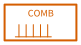

Key: `optics.comb`

**Ports** — `n` (analog), `out` (optical), `s` (analog), `w` (analog)

Its parameters change what they carry; these are the defaults.

| Parameter | Default | Accepts |
|---|---|---|
| `mode` | `fibre` | `fibre`, `free_space` |
| `power_dbm` | `0` | -60 to 40, step 1 |
| `wavelength_nm` | `0` | 0 to 12000, step 1 |

### Laser

Key: `optics.laser`

**Ports** — `n` (analog), `out` (optical), `s` (analog), `w` (analog)

Its parameters change what they carry; these are the defaults.

| Parameter | Default | Accepts |
|---|---|---|
| `mode` | `fibre` | `fibre`, `free_space` |
| `power_dbm` | `0` | -60 to 40, step 1 |
| `wavelength_nm` | `0` | 0 to 12000, step 1 |

### Laser Diode

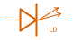

Key: `optics.laser_diode`

**Ports** — `n` (analog), `out` (optical), `s` (analog), `w` (analog)

Its parameters change what they carry; these are the defaults.

| Parameter | Default | Accepts |
|---|---|---|
| `mode` | `fibre` | `fibre`, `free_space` |
| `power_dbm` | `0` | -60 to 40, step 1 |
| `wavelength_nm` | `0` | 0 to 12000, step 1 |

### LED

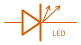

Key: `optics.led`

**Ports** — `n` (analog), `out` (optical), `s` (analog), `w` (analog)

Its parameters change what they carry; these are the defaults.

| Parameter | Default | Accepts |
|---|---|---|
| `mode` | `fibre` | `fibre`, `free_space` |
| `power_dbm` | `0` | -60 to 40, step 1 |
| `wavelength_nm` | `0` | 0 to 12000, step 1 |

### Narrow Linewidth

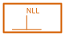

Key: `optics.nll`

**Ports** — `n` (analog), `out` (optical), `s` (analog), `w` (analog)

Its parameters change what they carry; these are the defaults.

| Parameter | Default | Accepts |
|---|---|---|
| `mode` | `fibre` | `fibre`, `free_space` |
| `power_dbm` | `0` | -60 to 40, step 1 |
| `wavelength_nm` | `0` | 0 to 12000, step 1 |

### SLED

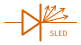

Key: `optics.sled`

**Ports** — `n` (analog), `out` (optical), `s` (analog), `w` (analog)

Its parameters change what they carry; these are the defaults.

| Parameter | Default | Accepts |
|---|---|---|
| `mode` | `fibre` | `fibre`, `free_space` |
| `power_dbm` | `0` | -60 to 40, step 1 |
| `wavelength_nm` | `0` | 0 to 12000, step 1 |
