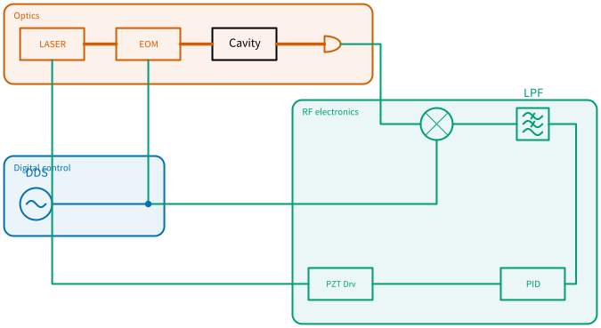

# Quickdraw manual

Quickdraw draws lab diagrams — optics, DSP and analog electronics in one picture, wired
up the way the bench actually is. You drag components onto a grid, pull wires between
their ports, and export vector artwork for a paper, a talk or a build sheet.

*`laser_lock.dsd`, one of the examples that ships with the app: a laser locked to a
cavity, with the optics, the detection electronics and the servo each in their own group.*

## Start here

| | |
|---|---|
| [Getting started](getting-started.md) | Install it, get past the first-launch warning, and learn what the window is made of |
| [Drawing a diagram](drawing.md) | Place symbols, wire them together, and do it quickly |

## Then, as you need it

| | |
|---|---|
| [Wires](wires.md) | The four kinds of wire, routing, waypoints, and why some wires hop |
| [Connections](connections.md) | Connectors, splices and soldered joints — and their insertion loss |
| [Labels and text](labels.md) | Naming things, and making a label say what a parameter says |
| [Organising a diagram](organising.md) | Containers, aligning and distributing |
| [Getting it out](output.md) | Export to SVG, PNG or PDF, Clean View, and the patch-list CSV |
| [Your own symbols](your-own-symbols.md) | Draw a part that isn't in the library, and share it |
| [The `.dsd` file](dsd-file.md) | What Quickdraw saves, and why it's plain text |
| [Keyboard reference](keyboard.md) | Every shortcut, on one page |
| [Symbol reference](generated/index.md) | All 88 symbols, with their ports and parameters |

## Getting help

Something broken, a symbol missing, or a diagram that came out wrong? Open an
[issue](https://github.com/Chathura-Bandutunga/Quickdraw_releases/issues). Include your
Quickdraw version and your operating system.
