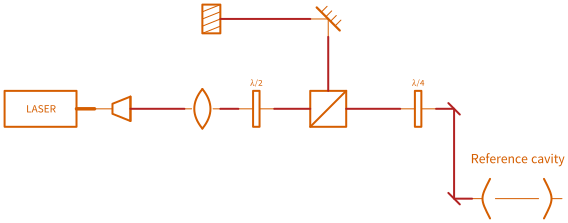

# Wires

## The four kinds

A wire's kind decides how it is drawn, and Quickdraw picks it from the ports you joined
rather than asking you.

| Kind | Carries | Drawn as |
|---|---|---|
| `analog` | Coax, BNC, SMA — any analog or RF electrical signal | A plain line |
| `digital` | Logic, clocks, data buses | A plain line, in the digital colour |
| `optical` | Light in fibre | A smoothly curved run, the way fibre lies |
| `beam` | Light in free space | Dead straight, with a fold-mirror tick at every turn |

The two optical kinds look different because they *are* different: fibre bends, and a
free-space beam only changes direction when something reflects it. A beam that turns a
corner gets a mirror drawn on the corner, because that is what would be there.

*`free_space.dsd` — every corner in the beam path carries its fold mirror.*

Components that convert between domains set this up for you. A photodiode has an optical
input and an electrical output, so wires either side of it are drawn correctly with no
intervention. A collimator bridges fibre and free space the same way.

You can override a wire's kind in its properties if you need to.

## Routing

Quickdraw routes wires around your symbols. Move a symbol and every wire touching it
re-routes immediately.

What counts as an obstacle is the symbol's drawn extent **including its label** — so
moving a label out of the way genuinely moves the wires out of the way too, which is
occasionally the easiest fix for a cramped corner.

## Waypoints

When the automatic route is not the one you want, right-click the wire where you want it
to go and choose **Add waypoint here**. The wire is pinned through that point and routes
around obstacles on either side of it. **Clear waypoints** on the same menu puts it back.

Waypoints are how you say "go around the *other* way" without hand-drawing the path — the
route is still computed, so it still updates when things move.

## Crossing hops

Where two wires cross without joining, the upper one steps over the lower one with a
small arc, so a dense diagram reads correctly.

**Free-space beams never hop.** Two beams that cross in a lab pass through one another,
so drawing a hop would assert a relationship that does not exist. If a beam crosses a
coax, though, the *coax* still hops — the rule is applied per wire, not per crossing.

A hop is skipped rather than shrunk when there is no room for it near a corner: a cramped
half-hop reads worse than none.

## Labelling a wire

Wires take labels like everything else — see [Labels and text](labels.md). A wire label
sits on the longest straight part of the route and moves with it, so it stays legible
when the wire re-routes.

## Link parameters

A wire can carry information beyond its picture: a connector type, a length, a loss.
These appear in the properties panel and are what the
[patch-list CSV](output.md#the-patch-list) exports. They are also what
[connections](connections.md) read for their detail text, so the drawing and the patch
list cannot end up disagreeing about what kind of connector is on a cable.

## Next

[Connections](connections.md) — what physically joins the two ends.
